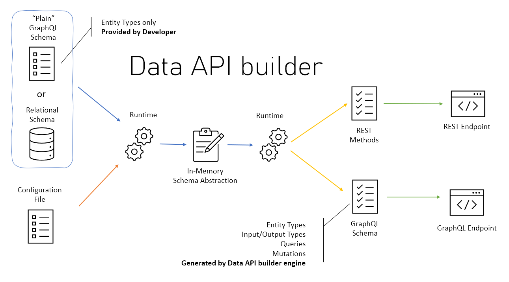

# Data API Builder

<div style="text-align:center">
    
</div>

**Feauture**
- Allow collections, tables, views and stored procedures to be accessed via REST and GraphQL
- Support authentication via OAuth2/JWT
- Support for EasyAuth when running in Azure
- Role-based authorization using received claims
- Item-level security via policy expressions
- REST
CRUD operations via POST, GET, PUT, PATCH, DELETE
filtering, sorting and pagination
GraphQL
- queries and mutations
filtering, sorting and pagination
relationship navigation
- Easy development via dedicated CLI
- Full integration with Static Web Apps via Database Connection feature when running in Azure


## Commnad Line for DAB

sample for use dab with command line

``` shell
# init data base connections with command line (we can use .env)
dab init --database-type mssql --connection-string "Server=localhost;Database=Library;"
# for add entity map in database
dab add Book --source dbo.Books --permissions "anonymous:*"
# for start dab server
dab start
```

**Optional**

```shell
# for need change type table with command line

dab add BookDetail --source dbo.vw_books_details --source.type View --source.key-fields "id" --permissions "anonymous:read"

"BookDetail": {
  "source": {
    "type": "view",
    "object": "dbo.vw_books_details",
    "key-fields": [ "id" ]
  },
  "permissions": [{
    "role": "anonymous",
    "actions": [ "read" ]
  }]
}

```


## How to deploy app with azure repository (ACR)
sample command line for deploy to ACR

``` shell
# first build image docker

docker build ./my-dab -t dab-builder:v1 

```

how to deploy image to ACR

```shell
# sample login
az acr login --name mycontainerregistry082
# get endpoint repository
az acr show --name mycontainerregistry082 --query loginServer --output table


Result
------------------------
mycontainerregistry082.azurecr.io


## sample push image to acr
docker push {mycontainerregistry082.azurecr.io}/aci-tutorial-app:v1

## last we can use azure portal to selected services to use with your conditions like as app services or contaniner services ..etc


```

** options tip **
when deploy we can use set system env or expose on linux / mac  to refferent key connections string

ref https://learn.microsoft.com/en-us/azure/container-instances/container-instances-tutorial-prepare-app


sample project
```shell

/P5MIN_INTERCONNECTORSOLN : key LASTCHANGED
/P5MIN_REGIONSOLUTION : key RUN_DATETIME
/PDR_REPORT_AUDIT : key PDR_REPORT_AUDIT
/PREDISPATCHINTERCONNECTORRES : key RUNNO
/PREDISPATCHPRICE  : key RUNNO
/PREDISPATCHREGIONSUM : key LASTCHANGED
/STPASA_INTERCONNECTORSOLN : key LASTCHANGED
/STPASA_REGIONSOLUTION : key LASTCHANGED

comming
/DISPATCHINTERCONNECTORRES
/DISPATCHPRICE
/DISPATCHREGIONSUM

```


